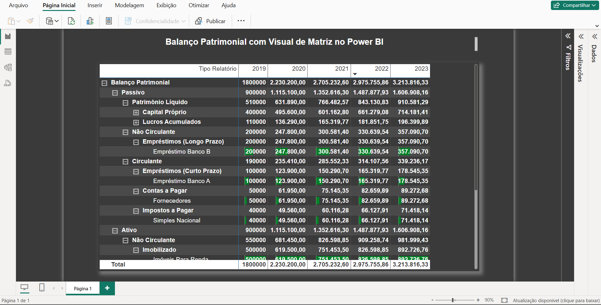

#  Balanço Patrimonial com Visual de Matriz

Dashboard que apresenta um balanço patrimonial por categoria e ano, usando matriz e segmentações visuais para facilitar a análise financeira detalhada.

## 🔧 Ferramentas utilizadas
- Power BI
- Visual de Matriz

## 📊 Informações Disponíveis
- Análise de ativos, passivos e patrimônio
- Visual segmentado por ano
- Tabelas dinâmicas e filtros interativos

## ▶️ Como visualizar
Arquivo `.pbix` disponível.

## 🖼 Captura de Tela

